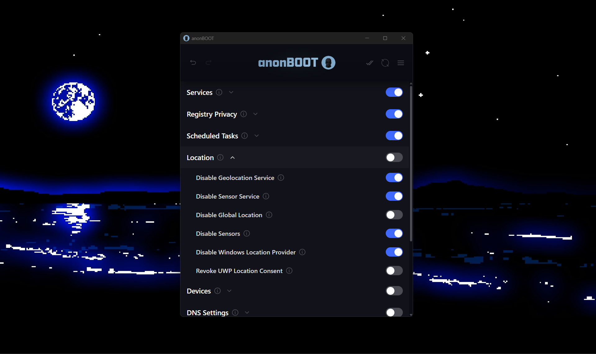

# For those who need PRIVACY
anonBOOT is a tool designed to edit system settings and optimize privacy. It's designed for those who want anonymity but enjoy using Windows.

This app alone will not hide your identity but should be used in conjunction with other  methods such as a VPN, etc. depending on the level of security you need.

This app does provide a clean interface to toggle privacy sensitive settings across Windows services, registry values, networking components, and system features.

## Download Link
**Download:** https://github.com/builtbybayn/anonBOOT/releases

## Administrator Privileges Required
anonBOOT must be run as Administrator.

This is not optional. The application modifies:
- Windows Registry keys
- System services
- Firewall and networking rules
- OS level privacy settings

If the app is launched without Administrator privileges, it won't run.

## Goals
anonBOOT does not claim to make you anonymous.  
It helps reduce unnecessary exposure and puts control of obscure, buried settings back into the user’s hands.

- Centralize relevant settings
- Reduce accidental data leaks
- Make privacy tradeoffs visible
- Transparent and auditable (Open source)

## Transparency & Trust

This project is open source so that:
- All behavior can be audited
- Users can see exactly what changes are being made
- No hidden behavior exists

There is no tracking, data collection, or anything of that sort

## Payments & Support

Support for anonBOOT is optional. The app is totally free to use.

- Traditional payments are handled **externally in your browser** via Stripe
- Cryptocurrency support is provided for users who prefer it.

All payment addresses and links are:
- publicly visible
- fetched from a public source
- cached locally for offline use

## Official Releases & Impersonation Warning

**Official anonBOOT builds are distributed ONLY from:**

- https://anonboot.app  
- https://github.com/builtbybayn/anonBOOT

Do not download anonBOOT from anywhere else.

The project will never ask you to:
- enter any credentials or KYC
- disable antivirus protections
- bypass UAC prompts outside normal Administrator elevation

## License

This project is licensed under the **Mozilla Public License 2.0 (MPL-2.0)**.

In short:
- The code is open and auditable
- Modifications must remain open
- Forks are allowed

See `LICENSE` for full details.

## Development

anonBOOT is actively developed.

Ongoing work focuses on:
- Additional configuration options
- MacOS version
- Edge cases
- More impactful apps for anonymity

## Feedback & Support

Feedback is welcome.

If you discover:
- incorrect behavior
- unsafe defaults
- anything noteworthy

please open an issue or reach out on GitHub. You can support the project through the `Support` menu in the app.
